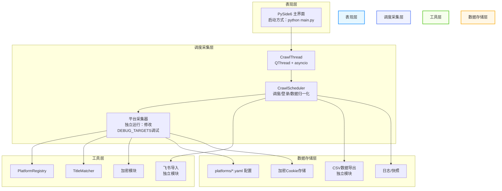
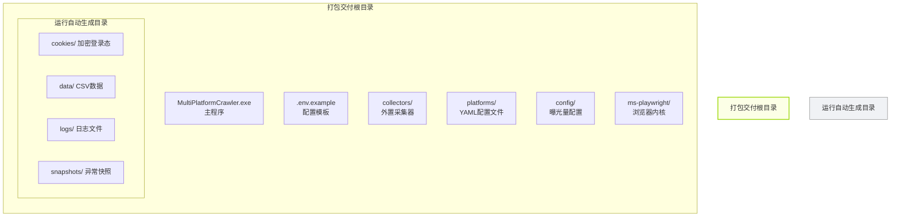
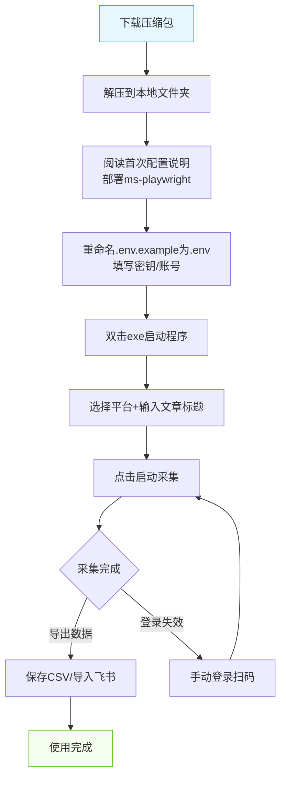

<!-- 本 README 由 AI 辅助生成，基于项目使用说明文档 -->

# 多平台内容采集系统


## 📖 项目概要

**多平台内容采集系统·极简使用说明**

- **定位**：面向运营/运维人员的一键式多平台文章数据采集工具，无需代码、无需安装环境，双击即用。
- **功能**：自动从 10 个主流内容平台（微信公众号、微博、头条、知乎、百家号等）抓取文章阅读、点赞、评论、转发等运营数据，支持导出 CSV 与一键同步飞书多维表格。总运行时长大概在 5 分钟左右。
- **总运行时长**：约 5 分钟

### 🚫 能力边界

- 仅采集大约两周以内发布的文章，不支持历史旧文采集
- 平台页面改版仅需改配置文件【结合 AI 编程工具自动分析】，无需动代码
- 单平台异常不影响其他平台，故障自动隔离
- 不支持批量无限爬取，单次最多采集 5 篇指定标题文章

## 📋 支持平台列表

| 平台标识 | 显示名称 | 登录方式 | 状态 |
|----------|----------|----------|------|
| `wechat` | 微信公众号 | 扫码登录 | ✅ 稳定 |
| `weibo` | 微博 | 自动填表 + 扫码兜底 | ✅ 稳定 |
| `toutiao` | 头条号 | 自动填表 + 扫码兜底 | ✅ 稳定 |
| `zhihu` | 知乎 | 自动填表 + 扫码兜底 | ✅ 稳定 |
| `baijiahao` | 百家号 | 自动填表 + 扫码兜底 | ✅ 稳定 |
| `netease` | 网易号 | 自动填表 + 扫码兜底 | ✅ 稳定 |
| `qq` | 企鹅号 | 扫码登录 | ✅ 稳定 |
| `yidian` | 一点资讯 | 自动填表 + 扫码兜底 | ✅ 稳定 |
| `zaker` | ZAKER | 自动填表 + 扫码兜底 | ✅ 稳定 |
| `xueqiu` | 雪球 | 扫码登录 | ✅ 稳定 |

> 注：微信公众号、企鹅号、雪球仅支持扫码登录，需手动扫码完成登录流程。

## 🏗️ 系统架构

### 1. 系统总技术架构图（核心）



### 2. GUI 界面架构图

```mermaid
flowchart TD 
    subgraph Qt 主界面 
        direction TB 
        A1[1. 平台选择模块<br/>10个平台复选框] 
        A2[2. 标题/关键词输入<br/>最多5条标题] 
        A3[3. 执行控制<br/>启动/暂停/停止] 
        A4[4. 手动登录队列<br/>登录失败平台] 
        A5[手动登录采集<br/>有头浏览器模式] 
        A6[5. 实时日志展示<br/>QTextBrowser] 
        A7[6. 采集结果表格<br/>11个标准字段] 
        A8[7. 工具模块<br/>CSV导出/飞书导入] 
    end

    %% 配色
    style Qt 主界面 fill:#fef0f0,stroke:#f5222d,stroke-width:2px
    style A1 fill:#ffffff,stroke:#333
    style A2 fill:#ffffff,stroke:#333
    style A3 fill:#ffffff,stroke:#333
    style A4 fill:#ffffff,stroke:#333
    style A5 fill:#ffffff,stroke:#333
    style A6 fill:#ffffff,stroke:#333
    style A7 fill:#ffffff,stroke:#333
    style A8 fill:#ffffff,stroke:#333
```

### 3. 打包后项目目录架构图



### 4. 打包版使用流程图（用户操作流程）



## 🚀 核心使用步骤

1. **解压程序包**，按说明复制浏览器缓存到电脑指定目录
2. **双击 exe** 启动程序，勾选要采集的平台
3. **输入最多 5 篇**近两周内发布的目标文章标题
4. **点击【启动采集】**，等待自动完成
5. **查看表格结果**，导出 CSV 或导入飞书
6. **登录失败时**使用【手动登录采集】补采即可

## 📥 安装步骤

### 1. 下载与解压

1. 下载项目压缩包到电脑本地，推荐下载到桌面
2. 右键压缩包选择**全部解压缩**
3. 解压后的文件夹可以保存在系统任意磁盘，推荐保存在桌面

### 2. 部署浏览器内核

1. 右键压缩文件：`ms-playwright.zip` 文件，选择**全部解压缩**
2. 复制解压后的 `ms-playwright` 文件夹
3. 打开文件资源管理器，在顶部搜索框粘贴：`%LOCALAPPDATA%` 并回车
4. 将 `ms-playwright` 文件夹粘贴到 `C:\Users\【你的用户名】\AppData\Local\` 目录下

> 注：如果输入命令没有跳转到指定目录，也可以依据目录路径模板手动查找到该目录

## 🖥️ 工具使用指导

### 1. 启动程序

1. 打开项目文件夹，双击 `MultiPlatformCrawler.exe` 文件
2. 稍等 5~10 秒，会弹出交互界面


### 2. 开始采集

1. **选择平台**：单个勾选或者全选要采集的平台
2. **输入标题**：输入最多 5 篇近两周内发布的目标文章标题
3. **点击启动**：点击【启动采集】按钮，等待采集进度条到达 100%
4. **查看结果**：观察'未匹配标题'，分析是否需要补采
5. **导出数据**：点击"导入飞书"或"导出 CSV"


### 3. 关键词输入

当选择了微博或头条平台，且输入的标题字符数大于 30 字时，会弹出关键词输入框。需要按照标题的关键词顺序输入，每个关键词之间空一个空格。


### 4. 手动登录与补采

#### 入口一：「需要登录平台」按钮

- **适用场景**：自动采集结束后，列表中出现登录失败平台时的快速补采
- **操作步骤**：
  1. 在列表中单选需补采的平台
  2. 点击 「手动登录采集」
  3. 弹出谷歌浏览器窗口，等待约 10 秒，页面稳定后手动完成扫码登录
  4. 切勿关闭浏览器，程序会自动完成剩余采集并关闭窗口
  5. 采集完毕后，浏览器页面会自动关闭，可选择点击"撤销该平台"

#### 入口二：「最终补采【手动登录，启动浏览器界面】」

- **位置**：位于"4. 手动登录平台"下方，是一个可折叠的独立分组
- **特点**：包含全部 10 个平台，其中微信公众号、企鹅号、雪球号置顶显示
- **适用场景**：
  - 自动采集卡住时，重启程序后单独对某平台进行有头补采
  - 需要观察浏览器操作过程时使用
- **使用步骤**：
  1. 确保主界面标题区至少填写了 1 个目标标题
  2. 在模块列表中单选一个平台
  3. 点击 「手动登录并采集」
  4. 系统以有头浏览器执行登录与采集（便于观察调试）
  5. 数据同样写入主数据表格


### 5. 共同注意事项

- 一次只能操作一个平台，多个平台需逐个处理
- 系统设置了 5 分钟登录等待时限，请在规定时间内完成扫码
- 登录成功后切勿关闭浏览器窗口，程序会自动处理后续流程
- 过程中不要重复点击按钮，待当前流程结束后再操作下一个

### 6. 分析数据汇总

- 采集到的数据会呈现到：6. 采集数据结果
- 重点关注：未匹配标题，分析是否需要补采


### 7. 导入飞书

1. 点击"导入飞书"按钮
2. 等待导入成功的信息弹窗
3. 显示导入成功后前往飞书多维表格核查

> 若因网络波动导致导入飞书失败，可点击"导出 CSV"，打开文件后全选数据，复制粘贴至飞书多维表格。


## ❓ 常见问题处理

### 1. 数据采集不完整（平台部分文章未采集到）

- **现象**：系统展示未成功采集的文章标题及对应平台
- **处理方法**：
  1. 单独勾选对应平台 + 输入未采集到的标题，重新发起采集
  2. 若重新采集仍失败：
     - 先手动核实该平台是否已发布对应文章
     - 未发布文章：完成发布后，将文章链接填入链接收集表格
     - 已发布但仍未采集到：直接将文章链接、数据填入链接收集表格

### 2. 平台完全无采集数据（登录态失效）

- **现象**：微信号、雪球号、企鹅号（QQ）完全无数据
- **处理方法**：
  1. 打开界面中的【手动登录采集模块】
  2. 选择无数据的平台（三类平台已在列表置顶），一次仅选一个
  3. 点击【手动登录并采集】，程序会自动弹出对应平台浏览器窗口
  4. 完成登录：
     - 微信号：等待页面跳转至扫码界面，自行扫码登录
     - 雪球号、企鹅号（QQ）：联系管理人协助扫码登录

### 3. 导入飞书失败

- **现象**：点击"导入飞书"后提示失败
- **处理方法**：
  1. 检查网络连接是否稳定
  2. 重新点击"导入飞书"按钮
  3. 若仍失败，点击"导出 CSV"，打开文件后全选数据，复制粘贴至飞书多维表格

## 🧹 日志和数据定期清理

- `\data\` 和 `\logs\` 文件夹内仅存放单次运行的数据与日志，可定期清理（直接全选文件夹内内容删除即可）
- **注意**：切勿误删其他文件，若不慎误删，可在回收站中还原

## 🔧 配置更新

### 平台账号密码更换、飞书 API 更新

1. 在项目文件夹中找到 `.env` 文件
2. 用记事本打开文件
3. 更新对应配置值（变量名不能修改，只能修改等号后面的值）
4. 保存文件并重启程序

### 飞书多维表格 API 配置指南

#### 1. 从链接提取 app_token & table_id

从多维表格链接中直接提取：
- **app_token**：wiki/或base/后至?前的字符串
- **table_id**：table=后至&前的字符串

#### 2. 权限配置

1. 飞书开放平台 → 自建应用 → 权限管理，勾选并开通：
   - 查看、评论、编辑和管理多维表格
   - 查看、评论、编辑和管理云空间中所有文件

2. 多维表格右上角「…」→ 更多 → 添加文档应用，搜索并添加自建应用

#### 3. .env 配置填写

```yaml
# 飞书多维表格配置
FEISHU_APP_ID=cli_xxxxxxxxxxxxxxxx
FEISHU_APP_SECRET=xxxxxxxxxxxxxxxx
FEISHU_APP_TOKEN=xxxxxxxxxxxxxxxx
FEISHU_TABLE_ID=xxxxxxxxxxxxxxxx
```

#### 4. 配置更新规则

| 场景 | 操作 | 是否重启程序 |
|------|------|--------------|
| 换表格/账号/密钥轮换 | 修改.env对应项 | 是 |
| 增删表格字段 | 确保字段与程序匹配 | 否 |

> ⚠️ 注意：
> - .env 修改后需重启程序生效
> - 表格需提前建好 11 个字段：发布日期、题目、发布平台、发布链接、曝光量、阅读、推荐、评论、点赞、转发、收藏

## 🔄 日常运维与平台改版应对

### 日常运维

查阅 `docs/` 目录下的《运维使用手册.md》，文档内包含详细的运维全流程说明及相关注意事项。

### 平台页面改版应对

查阅 `docs/` 目录下的《应对平台改版策略.md》，可获取平台页面改版后的具体应对方法及操作指引。

### 利用 AI 编程工具修复

1. 将《项目总技术文档.md》与《应对平台改版策略.md》提交给 AI
2. 在项目文件的 `\logs\` 目录中，找到对应待修复采集器的日志文件（日志以平台名称命名）
3. 将该日志内容复制粘贴给 AI，并说明这是对应失效平台的日志

> 注：更新频率较高的平台：微信公众号、微博号、百家号

## 📁 项目源代码目录结构

### 1. 原代码目录结构（打包前）

```
multi_platform_crawler/
├── main.py                 # 程序入口
├── gui.py                  # PySide6 主界面
├── controller.py           # 调度中心 CrawlScheduler
├── thread.py               # 采集子线程 CrawlThread
├── collectors/             # 各平台采集器（继承 BaseCollector）
│   ├── __init__.py
│   ├── template_collector.py
│   ├── wechat.py
│   ├── weibo.py
│   ├── toutiao.py
│   ├── zhihu.py
│   ├── baijiahao.py
│   ├── netease.py
│   ├── qq.py
│   ├── yidian.py
│   ├── zaker.py
│   └── xueqiu.py
├── platforms/              # YAML 配置文件（驱动采集逻辑）
│   ├── wechat.yaml
│   ├── weibo.yaml
│   ├── toutiao.yaml
│   ├── zhihu.yaml
│   ├── baijiahao.yaml
│   ├── netease.yaml
│   ├── qq.yaml
│   ├── yidian.yaml
│   ├── zaker.yaml
│   └── xueqiu.yaml
├── config/                 # 静态配置
│   └── exposure.yaml       # 静态曝光量配置
├── utils/                  # 工具模块
│   ├── __init__.py
│   ├── platform_registry.py
│   ├── data_model.py
│   ├── title_matcher.py
│   ├── exposure_loader.py
│   ├── ops.py
│   ├── feishu_worker.py
│   ├── feishu_exporter.py
│   ├── security.py
│   └── path_helper.py
├── docs/                   # 项目文档
├── cookies/                # 加密存储的登录态（运行时生成）
├── data/                   # 导出 CSV 数据（运行时生成）
├── logs/                   # 日志文件（运行时生成）
├── snapshots/              # 异常快照（运行时生成）
├── .env.example            # 环境变量配置模板
├── .gitignore              # Git 忽略文件
├── build_exe.bat           # 打包脚本
├── check_before_pack.py    # 打包前检查脚本
├── requirements.txt        # 依赖文件
├── test_migration.py       # 迁移测试脚本
└── 首次配置说明.txt         # 首次使用配置说明
```

### 2. 打包后目录结构

```
Crawler_Portable_vX.X.X/      # 交付文件夹
├── MultiPlatformCrawler.exe  # 主程序（可重命名为「多平台内容采集系统.exe」）
├── .env                     # 环境变量配置（用户创建）
├── collectors/              # 外置采集器
├── platforms/               # 外置 YAML 配置文件
├── config/                  # 系统配置
│   └── exposure.yaml        # 曝光量配置
├── ms-playwright/           # 浏览器内核
├── cookies/                 # 自动生成，存放加密 Cookie
├── data/                    # 自动生成，存放导出的 CSV
├── logs/                    # 自动生成，存放日志
├── snapshots/               # 自动生成，存放异常快照
└── 首次配置说明.txt          # 浏览器内核部署步骤
```

## 📦 模块架构与功能详解

### 1. 核心模块

#### 1.1 调度中心 (CrawlScheduler)
- **文件**：`controller.py`
- **功能**：负责平台调度、登录控制、数据归一化和异常处理
- **核心方法**：
  - `run()`: 主循环，逐平台执行采集
  - `execute_platform()`: 单平台采集执行
  - `execute_manual_crawl()`: 手动有头采集
  - `normalize_data()`: 数据归一化和曝光量注入
- **信号**：平台开始/结束、登录请求、数据就绪、任务完成等

#### 1.2 采集器模块 (collectors/)
- **文件**：`collectors/*.py`
- **功能**：实现各平台的具体采集逻辑
- **核心类**：`BaseCollector` (模板类)
- **标准接口**：
  - `crawl()`: 执行策略一采集，返回成功数据和未匹配标题
- **内置管理器**：
  - `ConfigLoader`: 加载 YAML 配置
  - `AntiSpiderHelper`: 反检测处理
  - `RetryManager`: 自动重试机制
  - `LoginManager`: Cookie 管理和登录处理
  - `NavigationManager`: 页面导航
  - `TitleMatcher`: 标题匹配算法
  - `ArticleListExtractor`: 文章列表提取

#### 1.3 工具模块 (utils/)
- **文件**：`utils/*.py`
- **功能**：提供通用工具和服务
- **核心模块**：
  - `platform_registry.py`: 平台注册与管理（单例）
  - `data_model.py`: 标准字段定义和映射
  - `title_matcher.py`: 三级标题匹配算法
  - `exposure_loader.py`: 静态曝光量加载（单例）
  - `feishu_worker.py`: 飞书导入独立线程
  - `feishu_exporter.py`: 飞书 API 封装
  - `security.py`: 敏感数据加密存储
  - `ops.py`: 日志轮转、健康检查、快照清理

#### 1.4 GUI 模块 (gui.py)
- **文件**：`gui.py`
- **功能**：用户界面和交互逻辑
- **核心区域**：
  - 平台选择模块（10个平台复选框）
  - 标题/关键词输入模块（最多5条标题）
  - 执行控制模块（启动/暂停/停止）
  - 手动登录队列模块（登录失败平台）
  - 手动登录采集模块（有头浏览器模式）
  - 实时日志模块（QTextBrowser）
  - 数据结果模块（QTableWidget，11个标准字段）
  - 工具模块（导出CSV、导入飞书、清空数据）

#### 1.5 线程模块 (thread.py)
- **文件**：`thread.py`
- **功能**：管理采集子线程和 asyncio 事件循环
- **核心类**：`CrawlThread` (继承 QThread)
- **职责**：
  - 接收主线程信号
  - 在子线程中执行调度中心逻辑
  - 发射信号更新 GUI

### 2. 配置体系

#### 2.1 平台配置文件 (platforms/)
- **文件**：`platforms/{platform}.yaml`
- **功能**：定义各平台的选择器、URL、超时、重试等配置
- **核心配置**：
  - 登录选择器（username、password、login_button）
  - 文章列表选择器（table、row、field）
  - 分页配置（next_button、max_pages）
  - 超时和重试设置

#### 2.2 静态曝光量配置 (config/)
- **文件**：`config/exposure.yaml`
- **功能**：定义各平台的静态曝光量值
- **特点**：支持实时修改，重启程序生效

#### 2.3 环境变量 (.env)
- **文件**：`.env`
- **功能**：存储敏感信息，如飞书 API 凭证和平台账号密码
- **注意**：该文件不提交到代码仓库，使用 `.env.example` 作为模板

### 3. 数据存储

#### 3.1 加密存储 (cookies/)
- **文件**：`cookies/*.enc`
- **功能**：存储加密后的 Cookie 登录态
- **加密方式**：AES-128 + HMAC（Fernet 对称加密）

#### 3.2 数据导出 (data/)
- **文件**：`data/*.csv`
- **功能**：存储导出的 CSV 数据
- **格式**：UTF-8-BOM，包含 11 个标准字段

#### 3.3 日志和快照
- **文件**：`logs/*.log` 和 `snapshots/{platform}_时间戳/`
- **功能**：记录程序运行日志和异常快照
- **特点**：
  - 日志按天轮转，保留 30 天
  - 异常快照包含截图、DOM 和堆栈，保留 7 天

### 4. 文档说明

#### 4.1 技术文档
- **文件**：`docs/项目总技术文档.md`
- **内容**：项目架构、核心模块、执行流程、配置体系等详细技术说明

#### 4.2 运维文档
- **文件**：`docs/运维使用手册.md`
- **内容**：日常运维流程、平台改版应对策略、常见故障处理等

#### 4.3 平台改版应对
- **文件**：`docs/应对平台改版策略.md`
- **内容**：平台页面改版后的具体应对方法和操作指引

#### 4.4 打包交付文档
- **文件**：`docs/交付、打包、迁移、稳定运维 & 平台改版应对方案.md`
- **内容**：打包流程、交付目录结构、迁移方案等

#### 4.5 首次配置说明
- **文件**：`首次配置说明.txt`
- **内容**：浏览器内核部署步骤和首次使用配置指南

## ⚠️ 免责声明

**免责声明**：本项目仅供学习、技术研究使用，请勿用于商业用途或非法采集他人数据。使用者应遵守各平台用户协议及相关法律法规，一切违法违规后果由使用者自行承担。

## 📦 打包与部署

### 打包步骤
1. **准备环境**：确保已安装 Python 3.11 和所有依赖（`pip install -r requirements.txt`）
2. **执行打包脚本**：运行 `build_exe.bat` 脚本
3. **生成位置**：打包后的文件将生成在 `D:\crawling_github\PythonProject5\multi_platform_crawler\dist` 目录
4. **交付准备**：将 `dist` 目录中的文件按照打包后目录结构组织成交付包

### 详细打包指南
项目提供了详细的打包步骤指导文档，包含 PowerShell 和 CMD 两套可执行的命令序列：
- **文件**：`docs/项目打包步骤.md`
- **内容**：包含环境说明、删除旧文件、激活虚拟环境、打包前检查、执行打包、确认产物位置、交付目录要求等完整步骤
- **适用场景**：适用于需要详细打包操作指导的用户

### 配置修改与重新打包
- **不需要重新打包的情况**：
  - 修改采集器配置文件（`platforms/*.yaml`）
  - 修改曝光量配置（`config/exposure.yaml`）
  - 修改环境变量（`.env`）
  - 更新采集器代码（`collectors/*.py`）
- **需要重新打包的情况**：
  - 修改核心模块代码（如 `main.py`、`gui.py`、`controller.py` 等）
  - 添加新的依赖包
  - 修改打包脚本或配置

### 部署说明
1. **浏览器内核**：将 `ms-playwright` 文件夹复制到 `%LOCALAPPDATA%\ms-playwright\`
2. **配置文件**：创建 `.env` 文件并填写必要的配置
3. **启动程序**：双击 `MultiPlatformCrawler.exe` 运行

## �� 许可证

[MIT](LICENSE)

---

**感谢使用多平台内容采集系统！** 🎉  
如有问题或建议，欢迎联系项目维护人员。