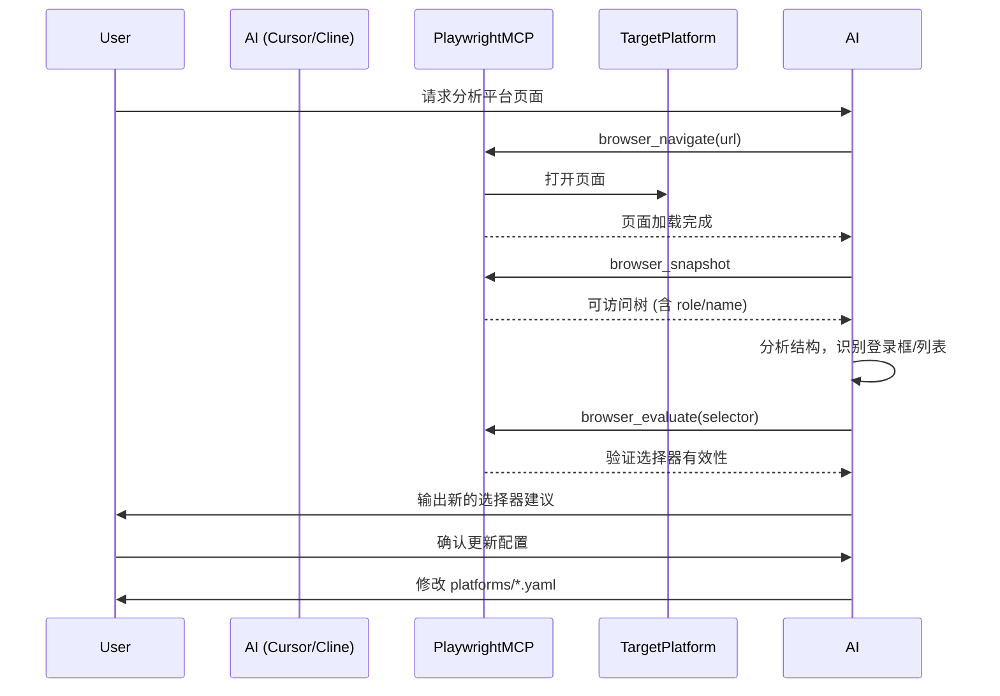

# 平台改版应对方案
**版本**: v1.1
**发布日期**: 2026-04-07
**适用对象**: 运维人员、开发者、AI 辅助工具
**核心工具**: 主流 AI 编程工具（Cursor / Cline / Continue）+ Playwright MCP
**目标**: 将平台改版后的页面分析、选择器提取、配置文件更新流程自动化，将运维时间从数小时压缩至数分钟。

---

## 1. 背景与痛点

### 1.1 平台改版的常见影响
- 登录页面 DOM 结构变化 → 自动登录失败
- 文章列表的 HTML 标签/ class 变化 → 无法定位行元素或字段
- 翻页按钮的 id/class 变化 → 无法翻页，采集范围不足

### 1.2 传统手动应对的痛点
| 步骤 | 耗时 | 难点 |
|------|------|------|
| 定位失效平台 | 5-10 分钟 | 需要查看日志 |
| 打开浏览器开发者工具 | 2 分钟 | - |
| 逐个查找新选择器 | 30-60 分钟 | 需要熟悉 CSS/XPath |
| 修改 YAML 文件 | 5 分钟 | 易出错 |
| 测试验证 | 10-20 分钟 | 反复试错 |
| **总计** | **约 1-2 小时/平台** | 依赖人工经验 |

### 1.3 自动化应对的优势
- **AI 辅助分析**: 自动识别登录框、列表容器、字段映射
- **Playwright MCP**: 实时交互页面，提取稳定的多级选择器
- **配置自动更新**: 更新符合项目规范的 YAML，保留其他配置不变
- **耗时**: 5-10 分钟/平台（含验证）

---

## 2. 方案概述

### 2.1 核心思路
```
用户发现平台失效 
    → 在 AI 编程工具中打开项目 
    → 调用 Playwright MCP 打开目标平台页面 
    → AI 自动分析页面结构 
    → AI 提取新的选择器（多级 Fallback） 
    → AI 更新 platforms/{platform}.yaml 
    → 保存后重启程序验证
```

### 2.2 工具链
| 工具 | 作用 |
|------|------|
| **Cursor / Cline / Continue** | 主流 AI 编程 IDE 插件，支持 MCP 协议 |
| **Playwright MCP** | Model Context Protocol 服务器，提供浏览器自动化能力（导航、快照、选择器提取） |
| **项目本地文件** | `platforms/*.yaml` 配置文件，`collectors/*.py` 采集器（无需修改） |

### 2.3 前置条件
- 已安装 AI 编程工具（以 Cursor 为例）
- 已配置 Playwright MCP 服务器（在 `mcp.json` 中添加）
- 项目已按标准目录结构存放（`platforms/`、`collectors/` 等）

### 2.4 项目文件路径配置（无硬编码优化版）
AI 工具基于**项目根目录相对路径**精准匹配文件，不绑定固定物理盘符/目录，核心路径指令如下：
```glob_path
{"pattern":"collectors/*.py"}
```
```glob_path
{"pattern":"platforms/*.yaml"}
```
```list_dir
{"target_directory":"collectors"}
```
```list_dir
{"target_directory":"platforms"}
```
```read_file
{"target_file":"platforms/qq.yaml"}
```
```read_file
{"target_file":"platforms/baijiahao.yaml"}
```
```read_file
{"target_file":"platforms/geekpark_web.yaml"}
```
```read_file
{"target_file":"platforms/geekpark_wechat.yaml"}
```
```read_file
{"target_file":"platforms/netease.yaml"}
```
```read_file
{"target_file":"platforms/toutiao.yaml"}
```
```read_file
{"target_file":"platforms/weibo.yaml"}
```
```read_file
{"target_file":"platforms/zhihu.yaml"}
```
```read_file
{"target_file":"platforms/yidian.yaml"}
```
```read_file
{"target_file":"platforms/zaker.yaml"}
```
```read_file
{"target_file":"platforms/xueqiu.yaml"}
```

---

## 3. 详细操作步骤（运维人员视角）

### 3.1 发现平台失效
- 程序日志中看到 `Login failed`、`No articles found`、`Timeout` 等错误
- 或者在 GUI 日志窗口明确提示某平台采集 0 条数据

### 3.2 打开 AI 编程工具并加载项目
- 用 Cursor 打开项目根目录

### 3.3 启动 Playwright MCP 会话
在 AI 对话中输入以下指令（示例）：
```
请使用 Playwright MCP 工具，打开 https://mp.toutiao.com/profile_v4/graphic/table（头条号数据后台），
并分析当前页面的文章列表结构，提取标题、阅读量、点赞量、评论量的选择器。
```

AI 会自动执行：
- `browser_navigate` 打开 URL
- `browser_snapshot` 获取页面可访问树
- 分析表格/列表容器
- 提取每个字段的 **至少 3 个备选选择器**（id > css > role > text）

### 3.4 对比新旧选择器
AI 会输出类似：
```
原配置中的文章行选择器为 "tr.article-item"，当前页面实际行为 "tbody tr.data-row"。
建议更新 article_list.row_selectors 为：
  - css: "tbody tr"
  - css: ".article-row"
  - role: "row"
```

### 3.5 自动更新 YAML 配置文件
运维人员可手动复制 AI 建议的选择器，或者让 AI 直接修改文件（需授权）。  
示例指令：
```
请根据上述分析，更新 platforms/toutiao.yaml 中的 article_list 部分，保留其他配置不变。
```

AI 会精确替换 YAML 中的相关选择器数组，并保留注释和原有其他字段。

### 3.6 验证修复
- 重启程序（或重新运行采集）
- 勾选该平台，输入已知标题，点击启动
- 确认能正常登录并采集到数据

### 3.7 目标平台基础信息汇总（11个平台）
#### 1. 企鹅号 (qq)
```json
{
  "platform_name": "qq",
  "display_name": "企鹅号",
  "login_url": "https://om.qq.com/userAuth/index",
  "login_instructions": "需要微信扫码登录，并且很频繁",
  "data_url": "https://om.qq.com/main/management/articleManage",
  "data_instructions": "内容管理【文章列表】：进入界面之后选择文章；状态选择已发布"
}
```

#### 2. 百家号 (baijiahao)
```json
{
  "platform_name": "baijiahao",
  "display_name": "百家号",
  "login_url": "https://baijiahao.baidu.com/builder/theme/bjh/login",
  "login_instructions": "百度账号登录，需要勾选同意协议复选框",
  "data_url": "https://baijiahao.baidu.com/builder/rc/content",
  "data_instructions": "内容管理页面，文章列表展示阅读、点赞、评论、转发、收藏等数据"
}
```

#### 3. 极客公园官网 (geekpark_web)
```json
{
  "platform_name": "geekpark_web",
  "display_name": "极客公园官网",
  "login_url": "https://account.geekpark.net/",
  "login_instructions": "邮箱+密码登录，账号：webupdate@geekpark.net",
  "data_url": "https://admin.geekpark.net/posts",
  "data_instructions": "后台文章列表，展示新闻ID、标题、作者、栏目、发布时间、PV阅读量"
}
```

#### 4. 微信公众号 (geekpark_wechat)
```json
{
  "platform_name": "geekpark_wechat",
  "display_name": "微信公众号",
  "login_url": "https://mp.weixin.qq.com/",
  "login_instructions": "微信扫码登录，5分钟超时，需点击内容管理->发表记录",
  "data_url": "https://mp.weixin.qq.com/cgi-bin/appmsgpublish?sub=list&begin=0&count=10",
  "data_instructions": "发表记录页：展示已发布文章列表，包含阅读、点赞、分享、评论人数"
}
```

#### 5. 网易号 (netease)
```json
{
  "platform_name": "netease",
  "display_name": "网易号",
  "login_url": "https://mp.163.com/subscribe_v4/index.html#/",
  "login_instructions": "邮箱登录，在iframe中输入账号密码，需先点击邮箱登录选项卡",
  "data_url": "https://mp.163.com/subscribe_v4/index.html#/content-manage",
  "data_instructions": "内容管理页面，选择图文标签，展示已发布文章及展现、观看、跟帖、点赞数据"
}
```

#### 6. 头条号 (toutiao)
```json
{
  "platform_name": "toutiao",
  "display_name": "头条号",
  "login_url": "https://sso.toutiao.com/login/",
  "login_instructions": "支持账密登录和手机验证码登录，需先切换到账密登录",
  "data_url": "https://mp.toutiao.com/profile_v4/graphic/articles",
  "data_instructions": "文章列表页，展示展现量、阅读量、点赞量、评论量等数据，支持翻页（约60篇）"
}
```

#### 7. 微博 (weibo)
```json
{
  "platform_name": "weibo",
  "display_name": "微博",
  "login_url": "https://passport.weibo.com/sso/signin",
  "login_instructions": "先点击账号登录切换到账密登录，再输入手机号和密码",
  "data_url": "https://me.weibo.com/content/article",
  "data_instructions": "文章管理页面，展示文章标题、发布时间、阅读、评论、点赞数据"
}
```

#### 8. 知乎 (zhihu)
```json
{
  "platform_name": "zhihu",
  "display_name": "知乎",
  "login_url": "https://www.zhihu.com/signin?next=%2F",
  "login_instructions": "默认验证码登录，需点击密码登录切换到账密登录",
  "data_url": "https://www.zhihu.com/organization/analytics/work/article?page=1&tab=single",
  "data_instructions": "机构号后台-单篇文章分析，表格展示标题、阅读量、互动数（赞同/评论/喜欢/收藏/分享）"
}
```

#### 9. 一点资讯 (yidian)
```json
{
  "platform_name": "yidian",
  "display_name": "一点资讯",
  "login_url": "http://mp.yidianzixun.com/#/ArticleManual/original/publish",
  "login_instructions": "邮箱+密码登录，先点击登录按钮显示登录表单",
  "data_url": "http://mp.yidianzixun.com/#/Home",
  "data_instructions": "内容管理页面，展示文章标题、发布时间、推荐、阅读、评论、分享、收藏数据"
}
```

#### 10. ZAKER (zaker)
```json
{
  "platform_name": "zaker",
  "display_name": "ZAKER",
  "login_url": "https://cms.myzaker.com/?login/index",
  "login_instructions": "账号密码登录，账号：geekpark，密码：geekpark2017",
  "data_url": "https://cms.myzaker.com/?home",
  "data_instructions": "点击内容管理->极客公园，进入文章列表iframe，展示标题、发布时间、阅读量"
}
```

#### 11. 雪球号 (xueqiu)
```json
{
  "platform_name": "xueqiu",
  "display_name": "雪球号",
  "login_url": "https://xueqiu.com/",
  "login_instructions": "微信扫码登录，Cookie失效较快，需频繁重新登录",
  "data_url": "https://mp.xueqiu.com/dataview/works",
  "data_instructions": "创作者后台-作品详情页，表格展示作品名称、阅读量、讨论量、转发量、点赞量、收藏量、个人主页访问量"
}
```
**注**：以上信息已排除搜狐号（sohu），该平台因不稳定已从系统中移除。

---

## 4. AI 工作流详解（技术实现）

### 4.1 MCP 工具调用序列



### 4.2 关键 MCP 工具说明

| 工具名 | 用途 | 示例 |
|--------|------|------|
| `browser_navigate` | 打开 URL | `browser_navigate(url="https://mp.toutiao.com")` |
| `browser_snapshot` | 获取页面可访问树（含所有元素的 `role`、`name`、`value`） | 返回结构化文本，AI 可解析 |
| `browser_click` | 点击元素（如登录按钮） | `browser_click(selector="button[type='submit']")` |
| `browser_fill` | 填充表单 | `browser_fill(selector="#username", text="user")` |
| `browser_evaluate` | 执行 JS 并返回结果 | `browser_evaluate(expression="document.querySelectorAll('.article-item').length")` |
| `browser_take_screenshot` | 截图保存 | 用于归档 |

### 4.3 选择器提取策略（AI 内部逻辑）

对于每个需要定位的元素，AI 会按以下顺序尝试并记录：

1. **ID 选择器**: `#elementId`（最稳定）
2. **CSS 类选择器**: `.class-name`（需确保唯一性）
3. **属性选择器**: `input[name='username']`、`[data-testid='login']`
4. **Role 选择器**: 通过 `browser_snapshot` 获取的 `role="textbox" name="账号"`（最接近人类描述）
5. **文本选择器**: `text="登录"`（易变，作为最后备选）
6. **XPath**: `//div[@class='login']//button`（最后手段）

**输出格式**（YAML 数组）：
```yaml
username_selectors:
  - id: "username"                    # 优先级1
  - css: "input[name='account']"      # 优先级2
  - role: "textbox"                   # 优先级3
    name: "请输入账号"
  - xpath: "//input[@type='text'][1]" # 优先级4
```

### 4.4 更新配置的原子操作

AI 在修改 YAML 时需遵循：
- 只替换目标字段的选择器数组，不改变其他字段（如 `timeout`、`user_agents`）
- 保留原有注释和格式
- 如果原配置中有多个选择器，**追加**新的高效选择器，**不删除**旧的（保留作为 Fallback）
- 使用 YAML 库解析和序列化，避免破坏结构

示例更新前后对比：
```yaml
# 更新前
row_selectors:
  - css: ".old-article-row"

# 更新后（追加新选择器）
row_selectors:
  - css: ".new-data-row"      # 新主选择器
  - css: ".old-article-row"   # 保留旧（可能仍有效）
  - role: "row"
```

---

## 5. 实战示例：头条号改版修复

### 5.1 故障现象
- 程序运行后，头条号采集返回 0 条数据
- 日志显示：`未找到文章行元素`

### 5.2 运维人员在 Cursor 中的操作

**Step 1: 启动 AI 对话**  
输入：
```
请使用 Playwright MCP 分析头条号文章列表页：https://mp.toutiao.com/profile_v4/graphic/table
需要提取：表格行选择器、标题、阅读量、评论量的新选择器。
```

**Step 2: AI 自动执行**（后台）  
- `browser_navigate` 打开 URL（需先登录，AI 可调用登录流程）
- `browser_snapshot` 获取页面结构
- 分析发现：原来 `tr.article-item` 已改为 `div.list-item`
- 提取：
  ```yaml
  row_selectors:
    - css: "div.list-item"
    - css: ".article-row"
    - role: "listitem"
  title: "div.title a"
  read: "span.read-num"
  comment: "span.comment-num"
  ```

**Step 3: AI 输出建议**  
```markdown
检测到页面结构变化，建议更新 platforms/toutiao.yaml：
- article_list.row_selectors 改为上述三个选择器
- field_selectors.title 改为 "div.title a"
- field_selectors.read 改为 "span.read-num"
```

**Step 4: 运维确认更新**  
输入 `同意，请更新配置文件`。

**Step 5: AI 修改 YAML**  
使用 `replace_in_file` 工具精确替换对应字段。

**Step 6: 验证**  
重启程序，选择头条号，输入标题，启动采集 → 成功返回数据。

**总耗时**: 约 3 分钟。

---

## 6. 最佳实践与注意事项

### 6.1 选择器稳定性原则
- **优先使用 data-testid**：若平台有自定义属性（如 `data-testid="article-title"`），优先使用。
- **避免使用动态 class**：如 `class="sc-xxxxx"` 每次构建变化。
- **基于角色定位**：`role="button" name="登录"` 通常比 CSS 类更稳定。

### 6.2 配置文件备份
- 修改前，AI 应自动备份原文件（如 `toutiao.yaml.bak`）
- 运维也可手动备份整个 `platforms/` 目录

### 6.3 回滚策略
- 若更新后仍失效，可快速恢复备份文件
- 使用版本控制系统（Git）管理配置变更

### 6.4 多平台批量更新
- 对于多个平台同时改版，可让 AI 依次分析每个平台
- 使用项目根目录下的 `platforms/` 列表循环处理

### 6.5 测试验证
- 更新配置后，建议先用**单个已知标题**测试
- 确认无误后再运行全平台采集

### 6.6 安全性
- Playwright MCP 的浏览器实例运行在本地，不会上传页面内容
- AI 工具仅访问项目文件，不泄露敏感信息

---

## 7. 工具配置指南（技术准备）

### 7.1 安装 Cursor（推荐）
- 下载 [Cursor](sslocal://flow/file_open?url=https%3A%2F%2Fcursor.sh%2F&flow_extra=eyJsaW5rX3R5cGUiOiJjb2RlX2ludGVycHJldGVyIn0=) 并安装
- 打开设置 → MCP → 添加服务器

### 7.2 配置 Playwright MCP
在 `~/.cursor/mcp.json`（或项目根目录 `.cursor/mcp.json`）中添加：
```json
{
  "mcpServers": {
    "playwright": {
      "command": "npx",
      "args": ["-y", "@executeautomation/playwright-mcp-server"],
      "env": {
        "PLAYWRIGHT_HEADLESS": "false"
      }
    }
  }
}
```

### 7.3 验证 MCP 连接
在 Cursor 的 AI 对话中输入：
```
请使用 playwright 工具打开 https://example.com
```
若能正常打开浏览器，说明配置成功。

### 7.4 项目上下文加载
- 将项目根目录添加到 Cursor 工作区
- AI 会自动索引 `platforms/` 下的 YAML 文件，了解当前配置

---

## 8. 故障排查指南

| 问题 | 可能原因 | 解决方案 |
|------|----------|----------|
| AI 无法打开页面 | Playwright MCP 未启动 | 检查 MCP 配置，重启 Cursor |
| 提取的选择器无效 | 页面动态加载内容 | 在分析前调用 `browser_wait_for` 等待特定元素出现 |
| AI 修改 YAML 后格式错乱 | 未使用 YAML 库 | 手动检查缩进，或要求 AI 重新生成 |
| 更新后仍无数据 | 字段选择器提取了错误内容 | 用 `browser_evaluate` 单独测试每个选择器 |
| 登录选择器失效 | 登录页面也改版了 | 先用相同方法分析登录页，更新 `login` 部分 |

---

## 9. 总结

### 9.1 核心价值
- **从 1-2 小时 → 3-5 分钟**：大幅降低平台改版应对时间
- **零代码修改**：只改 YAML 配置，无需重新打包
- **可重复执行**：每次改版都可用同一套流程

### 9.2 适用场景
- 平台常规 UI 改版
- 新增字段（如点赞量）需要添加到现有采集器
- 平台增加了反爬机制（需调整等待时间或模拟行为）

### 9.3 后续扩展
- 可集成 CI/CD 流程，定时自动检测平台结构变化并推送通知
- 建立选择器历史版本库，便于快速回滚

---

**文档结束**  
**维护者**: 系统架构组  
**更新记录**: 2026-04-07 初版发布；2026-04-07 v1.1 移除路径硬编码，优化文件寻址方式